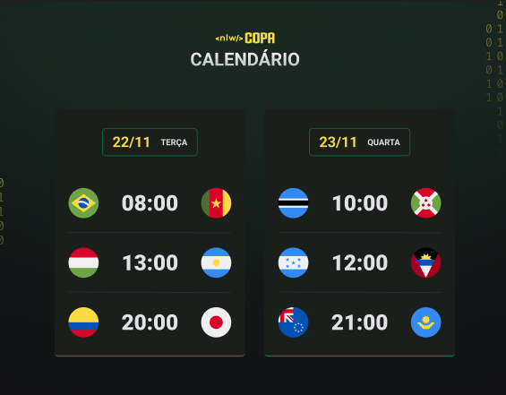

<h1 align="center"> NLW Copa 2022 </h1>

Evento exclusivo e gratuito, promovido pela Rocketseat para ensino de tecnologias WEB.

  <a href="#-tecnologias">Tecnologias</a>&nbsp;&nbsp;&nbsp;|&nbsp;&nbsp;&nbsp;
  <a href="#-projeto">Projeto</a>&nbsp;&nbsp;&nbsp;|&nbsp;&nbsp;&nbsp;
  <a href="#-layout">Layout</a>&nbsp;&nbsp;&nbsp;|&nbsp;&nbsp;&nbsp;
  <a href="#memo-licença">Licença</a>

  

 

Projeto original

  

Projeto atualizado por mim

  

## 🛠 Atualizações feitas por mim

Implementei uma função para trocar o tema da tela através do botão Alterar Tema, e inseri o nome dos paísesembaixo de suas respectivas bandeiras.

## 🚀 Tecnologias

Esse projeto foi desenvolvido com as seguintes tecnologias:

- HTML e CSS
- JavaScript
- Git e Github

## 💻 Projeto

O Calendário da Copa é um projeto que mostra as datas, horários e equipes que jogarão na primeira fase do campeonato da Copa do Mundo de 2022 no Qatar.

## 🔖 Layout

Você pode visualizar o layout do projeto através [DESSE LINK](https://www.figma.com/file/TV8k4cTr9Jdo4s4Wmz9EyU/Calend%C3%A1rio-de-Jogos-(Community)?node-id=0%3A1). É necessário ter conta no [Figma](https://figma.com) para acessá-lo.

## :memo: Licença

Esse projeto está sob a licença MIT.

---

Feito com ♥ by Rocketseat e Amandatc :wave: [Participe da nossa comunidade!](https://discord.gg/rocketseat)
